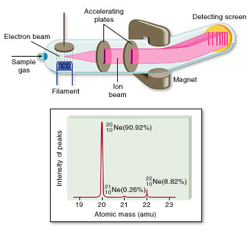

Mass spectroscopy the most poweful technique to weigh the molar masses of a given molecule. It is useful in indentifying unkonown compounds and studying their molecular structure. The principle consist of ionizing the sample in the gas phase to formed positively charged ion or radical ions and then measure the mass to charge ratio of all ions. It is largely used in industry and academia and finds application in chemistry, Biotechnology, pharmaceutical, environmental, Clinical, Geological fields. Different methods use different techniques for ionisation which intern determines what types of samples can be analyzed by mass spectrometry. Of all available methods Electron Ionisation or Impact mass spectroscopy is the the simplest of all mass technique that is widely used.  

  

Picture source:  
[http://www.mhhe.com/physsci/chemistry/chang7/esp/folder_structure/cl/m3/s3/index.htm](http://www.mhhe.com/physsci/chemistry/chang7/esp/folder_structure/cl/m3/s3/index.htm)