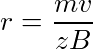

To understand the principle behind mass spectrometry, first, we need to look at the five important components of the mass spectrometer.

The mass spectrometer consist of five important components:

**a. Sample inlet:** Here, the sample under study is introduced into the chamber, and the pressure inside the sample inlet is much lower than the outside pressure. A stream of molecules is produced here.

**b. Ion Source:** The stream of molecules undergo ionization by various methods. Different compounds are ionized by different methods. This includes: Electron Ionisation(EI), Chemical Ionisation (CI), Secondary ion mass spectrometry (SIMS), Fast Atom Bombardment (FAB), and Matrix Desorption Ionisation (MALDI)

**c. Mass Analyser:** Separates the compound based on their mass to charge ratio (m/z).

**d. Detector:** The ions that are deflected under the magnetic field are detected by the detector.

**e. Output:** The signal is then recorded and processed by the data system. The output is the mass spectrum.

**1. Sample introduction:**

The sample analyzed by mass spectrometry can be a gas, liquid, or solid. The sample introduced into the sample inlet must first be vapourised so that the stream of molecules can reach the ionization chamber. For gas, a simple sample inlet is used from where the molecules of vapor can be drawn to the ionization chamber, which is maintained at a lower pressure than the sample inlet. For non-volatile samples, mostly the direct probe method is used. The sample is placed on a thin wire loop or pin on the tip of the probe, which is introduced to the ionization chamber through a vacuum lock. The sample probe is placed close to the ion source. When the probe is heated, the vapor from the samples is in close proximity to the ionizing beam.

The most versatile of all sample inlet systems is the one where a chromatograph is connected to the mass spectrometer. This way, the mixture of samples is first separated by the chromatograph, and the mass spectrum of each component thus separated can be determined individually.

**2. Ionization methods and the source of ionization:**

There are many different ionization methods for different applications base on the method of ionization.

Ionisation source Ionisation method
Electrospray Ionisation (ESI) Evaporation of charged droplets
Nano Electrospray Ionisation (nanoESI) Evaporation of charged droplets
Chemical Ionisation (CI) Proton transfer
Atmospheric Pressure Chemical Ionisation (APCI) Corona discharge and proton transfer
Matrix-Assisted Laser Desorption/Ionisation (MALDI) Proton absorption/ proton transfer.
Desorption/Ionisation On Silicon (DIOS) Proton absorption/ proton transfer
Fast Atom/Ion Bombardment (FAB) Ion desorption/ proton transfer
Electron Ionisation (EI) Electron beam/ electron transfer

**3. Electron Ionisation method:**

In all the mass spectrometers, regardless of the method used to determine the mass-to-charge ratio of a molecule/compound, first, the sample has to enter the mass spectrometer, then converted to charge particle by ion source before there are deflected by the magnetic field and detected. In EI-MS, a beam of high-energy electrons strikes the incoming molecules. The electron and the molecules collide, and the molecules form cations. A repeller plate that carries a positive electrical potential directs the newly created ions towards a series of acceleration plates. A large potential difference (1 to 10 kV) is applied across these plates to produce a beam of positive ions. There is a repeller plate that absorbs any negative ions. Molecules that are not ionized are drawn off by the vacuum. Most of the molecules or atoms require 8 to 15 electron volts to get ionized. But usually, the beam of electrons strikes the molecules at 50 to 70 eV. For recording, simple proton NMR spectra deuterated solvents, especially for the use of NMR, are used.

Salient features of the EI method:

1. Basic and well-understood ionization method
2. Ideal for all volatile compounds with masses less than 1000.
3. Leads to molecular ion fragmentation; fragmentation provides structural information.
4. Mass spectra are reproducible.

**4. Mass Analyzer:**

The mass analyzer is the part of the mass spectrometer where the ionized ions and, after being accelerated by the electric field, are separated based on their mass to charge ratios. Similar to the ionization technique, there are different types of mass analyzers available.

 
  

The Magnetic Sector Mass AnalyzerGreater mass to charge ratio has a larger radius of the curved path Double \_Focusing Mass AnalyzerSimilar to Magnetic sector buy higher resolution (10 or more folds) Quadrupole Mass Analyzer Ions with the correct mass-to-charge ratio undergo stable oscillation and passes through the cylindrical rods (DC voltage and RF is applied to the rods) before they hit the detector Time of Flight Mass Analyze (TOF)Velocities of two ions created at the same time and with same kinetic energy varies with the mass of the ions. Lighter ions have a higher velocity.

 
  

Figure 2: Schematics of the mass spectrometer with quadrupole mass analysis.

Picture [source](https://compbio.pbworks.com/w/page/16252899/Mass%20Spectrophotometry%20and%20Protein%20Interaction%20Networks)

**The magnetic sector mass analysis:**

The kinetic energy of an accelarated ion imparted by the voltage V is:

 
  

Where m is the mass of the ion, v is its velocity, and z is the charge. When the ions pass through the two poles of a magnet, the charged particles take a curve path. The radius of curvature (r) of this path is:

  
 
  

where B is the magnetic field strength.

Combining the above two equations:

 
  

Greater the value of m/z value larger is the radius of the curved path. The analyzer tube has a fixed radius of curvature, and the magnetic field strength is varied such that all the ions reach the detector.

 
  

Picture [source](https://orgchemguide.blogspot.in/2011/04/magnetic-deflection-or-sector-mass.html)

**5. Detector:**

After passing through the mass analyzer, the ions strike the detector. The detector in a mass spectrometer is the counter which produces current proportional to the number of ions that strike it. In a mass analyzer that sweeps through a range of 35 to 300 m/z, an ion of a given mass-to-charge strikes the detector one time out of 300. The mass spectrum amplifies even tiny current into an electrical signal. Each peak represents a small electrical signal.

**6. Output:**

The output in mass spectrometry is the mass spectra which is a stick diagram showing relative current produced by ions with respect to varying mass-to-charge ratios. The vertical axis is the relative abundance or relative intensity, and the x-axis is the mass-to-charge. Greater the current larger is the abundance of the ion.

**Fragmentation patterns for organic compounds:**

In EIMS spectrometry, the molecule is bombarded by high-energy electrons, and this results in the sample molecule losing an electron to form a radical cation. If the lifetime of this molecular ion is greater than 10-5 sec, a peak corresponding to its mass appears in the mass spectrum. And incase the lifetime is less than 10-5 sec, the molecular ion breaks apart into fragments before they are accelerated within the ionization chamber and enter the mass analyzer. Peaks corresponding to the mass-to-charge of the fragments appear in the mass spectrum. Not all the molecular ions formed by ionization have the same lifetime, and so a typical EI mass spectrum has peaks corresponding to both the molecular ion and the fragment ions.
